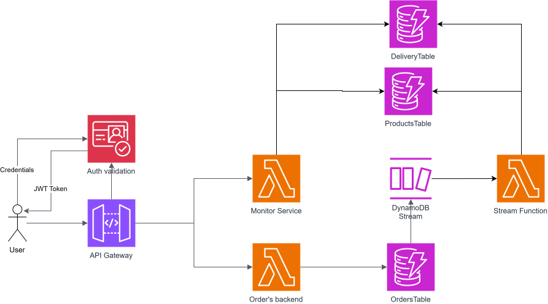
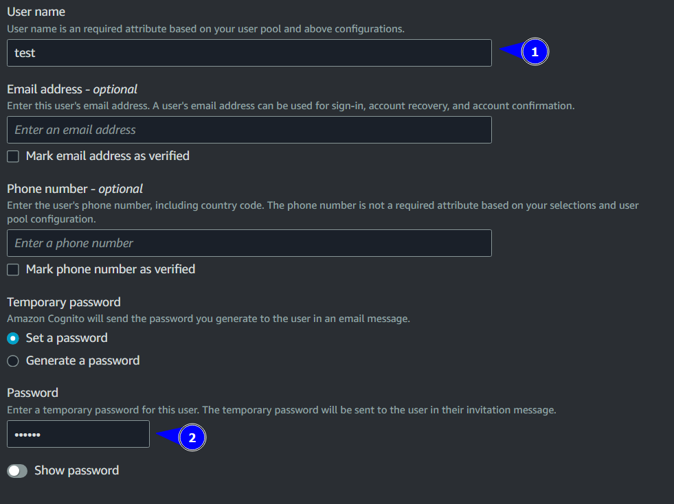
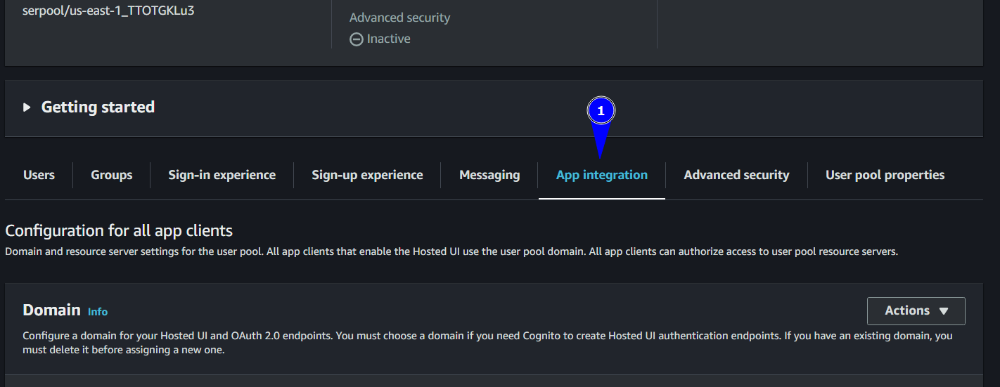
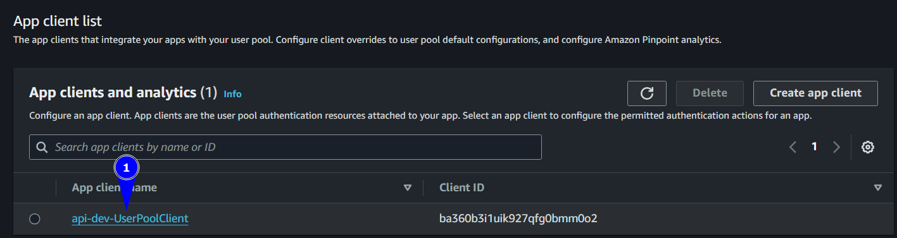
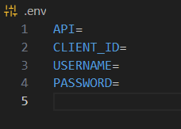
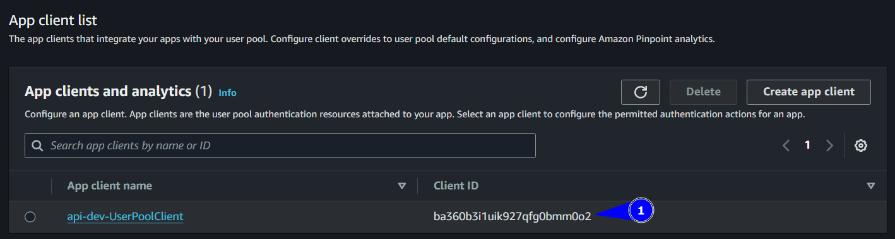
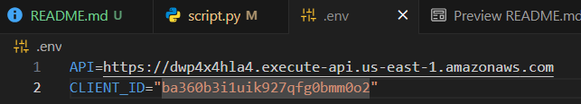
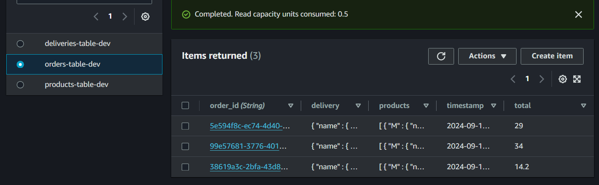

# Serverless REST API con Flask, DynamoDB y DynamoDB Streams
Servicio REST para recibir peticiones de pedidos para la empresa Cargo Express usando [serverless framework](https://github.com/serverless/serverless), siendo esta una herramienta para la construcción y despliegue de aplicaciones serverless usando el marco de trabajo de IaC. En este documento se van a ver todos los aspectos tecnicos, incluyendo diseño 
de arquitectura, modelamiento de datos, además de incluir un tutorial para el correcto despliegue del servicio.

## Contenido
- [Modelo de arquitectura](#modelo-de-arquitectura)
- [Modelo de datos](#modelo-de-datos)
- [Preguntas teoricas](#preguntas-teoricas)
- [Tutorial de despliegue](#tutorial-de-despliegue)
  - [Como probar el servicio](#como-probar-el-servicio)

## Modelo de arquitectura



Como se aprecia en la imagen, el punto de acceso es por medio del API Gateway, este redirigue las peticiones a su respectivo endpoint, mapeado logicamente por las rutas. Cada endpoint 
está desplegado en una función Lambda, la función `Orders backend` es encargada de registrar en una base de datos DynamoDB los pedidos de la empresa, mientras que `Monitor service` es el encargado de ofrecer información relacionada con el monitoreo de los pedidos de la empresa. Cada vez que se registra un pedido, con el fin de poder tener datos de monitoreo en **casi tiempo real**, se tiene DynamoDB Stream, este cumple la función que cada vez que se registra un nuevo pedido, se activa un trigger que envía la información recién ingresada a la función Lambda `Streams function` esta almacenará los datos en otras tablas de DynamoDB, las cuales estarán disponibles para el endpoint relacionado con el monitoreo. Con el objetivo de añadir una capa de seguridad, se implementó Amazon Cognito el cual proporciona un servicio de autenticación a los usuarios de la aplicación. Esto se logra mediante la creación y validación de tokens JWT generados por este servicio. Todos los endpoints están protegidos mediante un autorizador JWT en el api gateway.

### Especifcación de endpoints
- `/orders/` 
    -  POST - Encargado de la creación de pedidos en la base de datos. Requiere un payload detallado en `script.py` 
    para registrar el pedido hecho incluyendo información de productos, del repartidor además un estampa de tiempo.
- `/monitor/`
    - GET - Encargado de obtención de información de monitoreo de los pedidos. Este ofrece las siguientes metricas:
        - Productos mas vendidos.
        - Repartidores con el total de productos vendidos.
        - Repartidores con el total de dinero generado.

## Modelo de datos


> Como se evidencia hay atributos que se repiten entre tablas, esto se hizo con el fin de que las consultas a la base de datos fueran mas sencillas, sin embargo, si se busca economizar almacenamiento, tocaría realizar un proceso de normalización.

### Orders
En la tabla de ordenes tiene toda la información relacionada con el pedido realizado, se almacena el id de la orden, el total del dinero de esa orden, y la fecha en la que se realizó. En el campo de delivery se guarda un map con información de quien hizo el envío con su nombre e identificación. Por último, se tiene una lista de maps, los cuales especifican detalles del producto, con su id, nombre y precio unitario. 
### Deliveries
Esta tabla tiene información relacionada con el repartidor, incluye también nombre y id de este. Además de incluir información relacionada con su rendimiento, como cuantos productos ha enviado hasta el momento y cuanto dinero a generado.
### Products
Esta última tabla contiene información de los productos como y id, pero además incluye información relacionada con la cantidad de veces que se ha vendido un producto.


## Preguntas teoricas
La empresa tiene una proyección de expansión en sus operaciones de un 500% en el próximo año y duplicala en el segundo año. 
### ¿Qué recomendaciones le darías para que pueda garantizar su operación? 
### ¿La solución planteada se encuentra en la capacidad de responder la demanda durante los próximos dos años?

## Tutorial de despliegue
Para poder desplegar la arquitectura en AWS es [necesario tener instalado npm](https://docs.npmjs.com/downloading-and-installing-node-js-and-npm). Luego de tenerlo instalado, se debe ejecutar este comando para instalar el paquete de serverless framework

```bash
npm i serverless -g
```


Para verificar que se encuentra instalado puedes ejecutar el siguiente comando
```bash
sls --version
```
Si todo esta bien te debería salir algo como esto
```bash
Serverless ϟ Framework

 • 4.3.2
```
Una vez confirmado que tengas instalado serverless ve a la carpeta de `/api/` y ejecuta el siguiente comando para descargar todas las dependencias necesarias para poder desplegar la aplicación.
```bash
cd api
npm install
``` 
Una vez se descargaron todas las dependencias, ejecuta el siguiente comando para desplegar la arquitectura
```bash
sls deploy
``` 
> [!WARNING]
> Recuerda tener instalado pip y python 3.12 si te llegar a salir un error como este "`python3.12 -m pip help install Exited with code 1`"
> [!INFO]
> > Lastimosamente en las ultimas versiones de serverless framework está pidiendo loguearse en la pagina de ellos una vez que se quiere desplegar la arquitectura, por lo tanto es necesario crearse una cuenta en esta plataforma para poder ver en ejecución la arquitectura.

> Para poder desplegar la arquitectura es necesario [tener funcional el CLI de AWS](https://docs.aws.amazon.com/cli/latest/userguide/getting-started-install.html), así como de 
[tener configuradas las credenciales de tu cuenta en AWS](https://docs.aws.amazon.com/cli/latest/userguide/getting-started-quickstart.html), recomiendo usar la opción de "Short-term credentials"

Esto lo que hará es, usando tus credenciales, desplegar la arquitectura de manera automatizada pudiendo ser monitoreada en CloudWatch, y saber exactamente los recursos que se desplegaron en el `serverless.yml` o también en CloudFormation. Una vez desplegado te saldrá algo como esto en la consola.

```bash
Packaging Python WSGI handler...

✔ Service deployed to stack api-dev (81s)

endpoints:
  ANY - https://dwp4x4hla4.execute-api.us-east-1.amazonaws.com/order
  ANY - https://dwp4x4hla4.execute-api.us-east-1.amazonaws.com/order/{proxy+}
  ANY - https://dwp4x4hla4.execute-api.us-east-1.amazonaws.com/monitor
  ANY - https://dwp4x4hla4.execute-api.us-east-1.amazonaws.com/monitor/{proxy+}
functions:
  orders-api: api-dev-orders-api (1.8 MB)
  monitor-api: api-dev-monitor-api (1.8 MB)
  stream_function: api-dev-stream_function (1.8 MB)
``` 
Esto quiere decir que la arquitectura se desplegó correctamente.
### Como probar el servicio
Usando el archivo `script.py` se puede usar para realizar las respectivas pruebas al servicio. Sin embargo, se deben seguir estos pasos para que funcione al ejecutarlo.
1. Ingresas a la consola de AWS y busca el servicio Cognito.
2. Dale en la opción de crear usuario


3. Ingresa nombre de usuario y una contraseña de 6 caracteres



 4. Una vez creado, ve a la pestaña de AppIntegration


 

 5. Baja hasta App client list y oprime en el nombre del app client

 

 6. Baja hasta la opción de Hosted UI y oprime en View Hosted UI

 

 7. Una vez acá escribe tu usuario y contraseña que escribiste en el paso 3, te pedirá que ingreses una nueva contraseña y un correo, el correo no es necesario que sea real.
 8. Probablemente te salga un error en el navegador, sin embargo se confirma que el usuario cambió su contraseña correctamente.

 9. Ve a la carpeta raiz del proyecto y crea un archivo `.env` con la siguiente estructura

 

 10. En la variable `API` pon la URL raíz que te salió una vez desplegada la arquitectura.

 11. En la variable `CLIENT_ID` pon el id del app client **entre comillas**, este se encuentra en la interfaz vista en el paso 5.

 

 12. Una vez copiados y pegados se debería ver asi



13. Por último, en el código de `script.py`, entre la línea 86 y 90, escribe las credenciales del usuario (Nombre de usuario y la nueva contraseña que creaste). En este caso mi usuario es test y la contraseña es maziooo


14. Ahora puedes ejecutar el `script.py` para ver la arquitectura funcionando. En la consola te presentará el access token, además imprimirá como se crean 3 productos, usando Postman puedes usar el endpoint `/monitor/` con el access token para ver las respuestas del monitoreo a la información.


15. En DynamoDB en la consola de AWS en la opción de tablas, puedes ver los registros de ordenes, productos y deliveries.

