# Serverless REST API with Flask, DynamoDB, and DynamoDB Streams
A REST service to handle order requests for the company Cargo Express using the [serverless framework](https://github.com/serverless/serverless), which is a tool for building and deploying serverless applications using Infrastructure as Code (IaC). This document covers all technical aspects, including architectural design, data modeling, and includes a tutorial for the proper deployment of the service.
> There is an Spanish version of this document, you can find it at [README.md](./README.md)
## Contents
- [Architectural Model](#architectural-model)
- [Data Model](#data-model)
- [Theoretical Questions](#theoretical-questions)
- [Deployment Tutorial](#deployment-tutorial)
  - [How to Test the Service](#how-to-test-the-service)

## Architectural Model

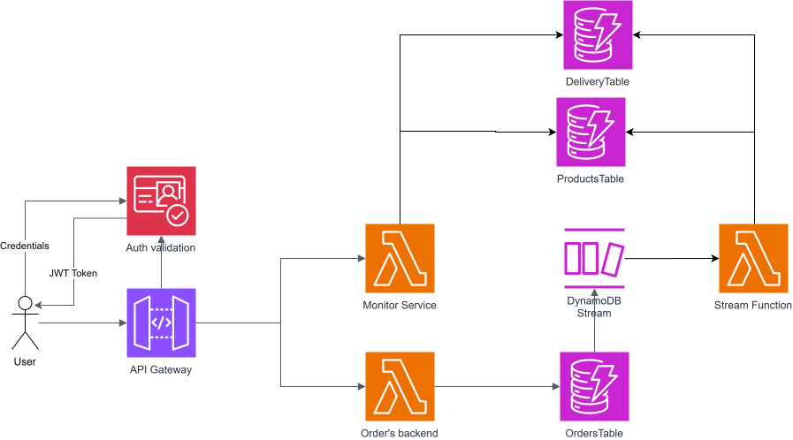

As seen in the image, the entry point is through the API Gateway, which redirects requests to their respective endpoints, logically mapped by the routes. Each endpoint is deployed in a Lambda function. The `Orders backend` function is responsible for recording company orders in a DynamoDB database, while the `Monitor service` provides information related to monitoring the company's orders. Each time an order is registered, to have monitoring data in **almost real-time**, DynamoDB Streams is used. This triggers the `Streams function` Lambda function every time a new order is registered, sending the newly entered information to the function, which then stores the data in other DynamoDB tables. These tables are available for the monitoring-related endpoint. To add a layer of security, Amazon Cognito was implemented to provide authentication services to application users. This is achieved through the creation and validation of JWT tokens generated by this service. All endpoints are protected by a JWT authorizer in the API Gateway.

### Endpoint Specifications
- `/orders/`
    - POST - Responsible for creating orders in the database. Requires a detailed payload in `script.py` to record the order, including product information, the delivery person, and a timestamp.
- `/monitor/`
    - GET - Responsible for obtaining monitoring information about orders. It provides the following metrics:
        - Most sold products.
        - Delivery persons with the total number of products sold.
        - Delivery persons with the total amount of money generated.

## Data Model

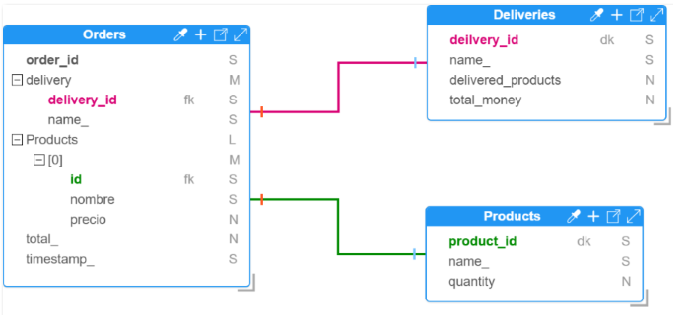

> As evidenced, there are attributes that repeat across tables. This was done to simplify database queries, but if storage efficiency is a concern, normalization would be required.

### Orders
The orders table contains all information related to the placed order. It stores the order ID, the total amount of the order, and the date it was placed. The delivery field contains a map with information about who made the delivery, including their name and ID. Lastly, there is a list of maps specifying product details, including ID, name, and unit price.

### Deliveries
This table contains information related to the delivery person, including their name and ID. It also includes performance-related information, such as how many products they have delivered so far and how much money they have generated.

### Products
This table contains information about products, such as ID and name, and also includes information about how many times a product has been sold.

## Theoretical Questions
The company projects a 500% expansion in its operations over the next year and a doubling of that in the second year. 
### What recommendations would you give to ensure their operations?
### Is the proposed solution capable of meeting the demand over the next two years?

## Deployment tutorial
In order to deploy the architecture on AWS you [need to have npm installed](https://docs.npmjs.com/downloading-and-installing-node-js-and-npm). After having it installed, you must run this command to install the serverless framework package.

```bash
npm i serverless -g
```
To verify that it is installed you can run the following command
```bash
sls --version
```
If everything is ok you should get something like this
```bash
Serverless ϟ Framework

 - 4.3.2
```
Once you have confirmed that you have serverless installed go to the `/api/` folder and run the following command to download all the dependencies needed to be able to deploy the application.
```bash
cd api
npm install
``` 
Once all the dependencies are downloaded, run the following command to deploy the architecture
```bash
sls deploy
``` 
> [!WARNING]
> Remember to have pip and python 3.12 installed if you get an error like this ``python3.12 -m pip help install Exited with code 1``”

> [!NOTE]
> Unfortunately in version 4 of serverless framework is asking to log in their page once you want to deploy the architecture, so it is necessary to create an account on this platform to see the architecture running, or [run it in version 3](https://www.serverless.com/framework/docs/getting-started#pinning-to-a-specific-version).

> To be able to deploy the architecture it is necessary to [have the AWS CLI functional](https://docs.aws.amazon.com/cli/latest/userguide/getting-started-install.html), as well as [have the AWS CLI functional](https://docs.aws.amazon.com/cli/latest/userguide/getting-started-install.html), as well as to 
To be able to deploy the architecture you need to [have your AWS account credentials configured](https://docs.aws.amazon.com/cli/latest/userguide/getting-started-quickstart.html), I recommend using the “Short-term credentials” option.

What this will do is, using your credentials, deploy the architecture in an automated way so it can be monitored in CloudWatch, and know exactly the resources that were deployed in the `serverless.yml` or also in CloudFormation. Once deployed you will get something like this in the console.

```bash
Packaging Python WSGI handler...

✔ Service deployed to stack api-dev (81s).

endpoints:
  ANY - https://dwp4x4hla4.execute-api.us-east-1.amazonaws.com/order
  ANY - https://dwp4x4hla4.execute-api.us-east-1.amazonaws.com/order/{proxy+}
  ANY - https://dwp4x4hla4.execute-api.us-east-1.amazonaws.com/monitor
  ANY - https://dwp4x4hla4.execute-api.us-east-1.amazonaws.com/monitor/{proxy+}
functions:
  orders-api: api-dev-orders-api (1.8 MB)
  monitor-api: api-dev-monitor-api (1.8 MB)
  stream_function: api-dev-stream_function (1.8 MB)
``` 
This means that the architecture was deployed correctly.
### How to test the service
Using the ``script.py`` file can be used to perform the respective tests to the service. However, you must follow these steps to make it work when you run it.
1. Log into the AWS console and search for the Cognito service.
2. Click on the create user option

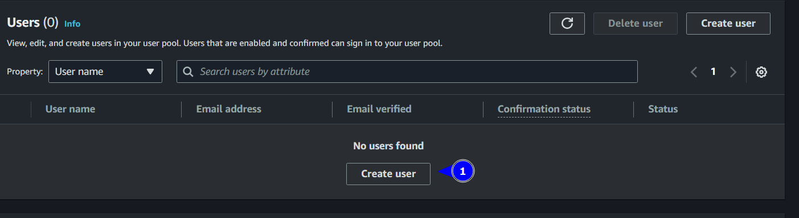

3. Enter username and a 6-character password.

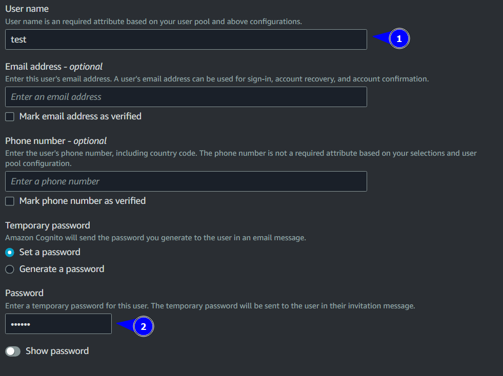

4. Once created, go to the AppIntegration tab.


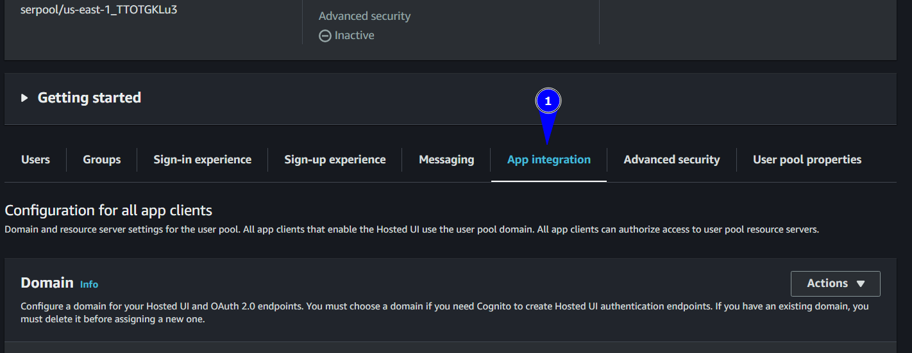

5. Scroll down to App client list and click on the app client name

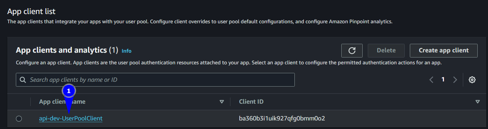

6. Scroll down to the Hosted UI option and click on View Hosted UI

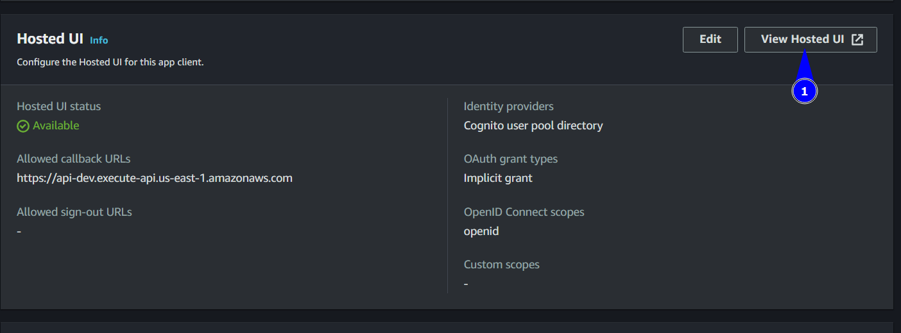

7. Once here type your username and password that you wrote in step 3, it will ask you to enter a new password and an email, the email does not need to be real.
8. You will probably get an error in the browser, however it confirms that the user changed his password correctly.

9. Go to the root folder of the project and create an `.env` file with the following structure

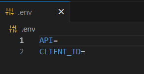

10. In the `API` variable put the root URL that you got after the architecture was deployed.

11. In the variable `CLIENT_ID` put the id of the app client **between quotes**, this is in the interface seen in step 5.

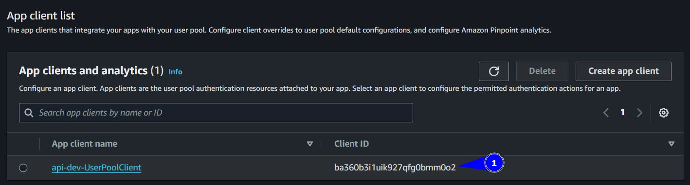

12. Once copied and pasted it should look like this

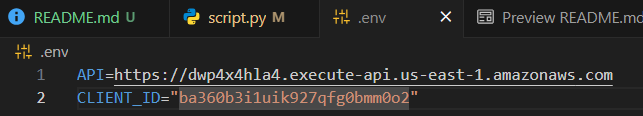

13. Finally, in the `script.py` code, between line 86 and 90, type the user credentials (Username and the new password you created). In this case my user is test and the password is maziooo

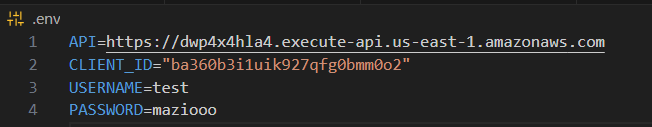

14. Now you can run the `script.py` to see the architecture working. In the console it will present you with the access token, it will also print out how 3 products are created, using Postman you can use the `/monitor/` endpoint with the access token to see the monitoring responses to the information.

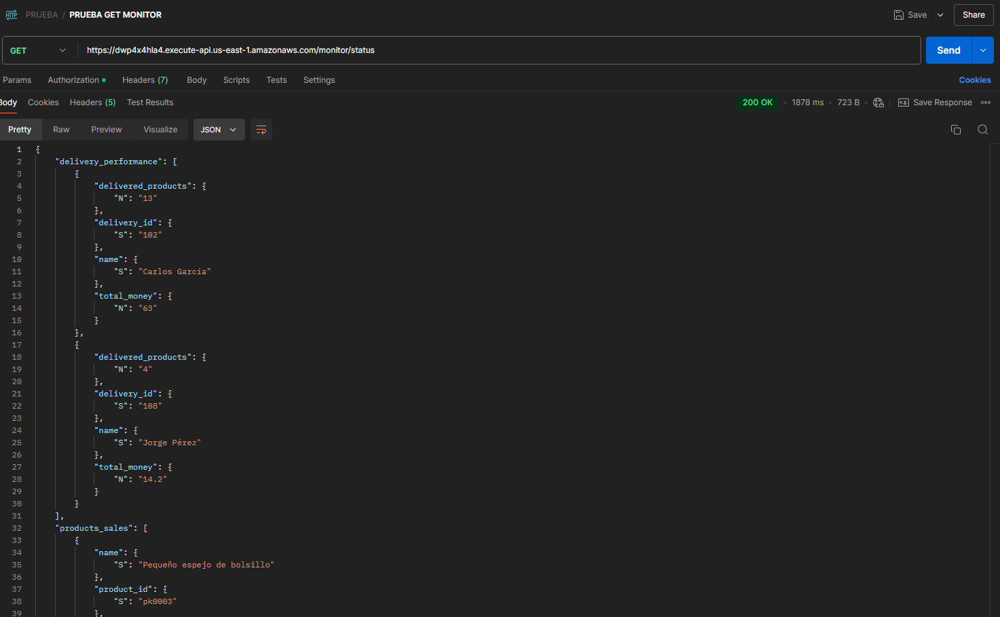

15. In DynamoDB in the AWS console in the tables option, you can view the order, product and deliveries records.

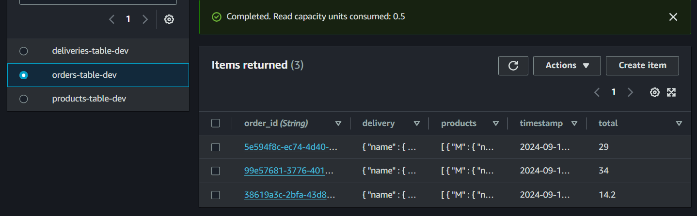